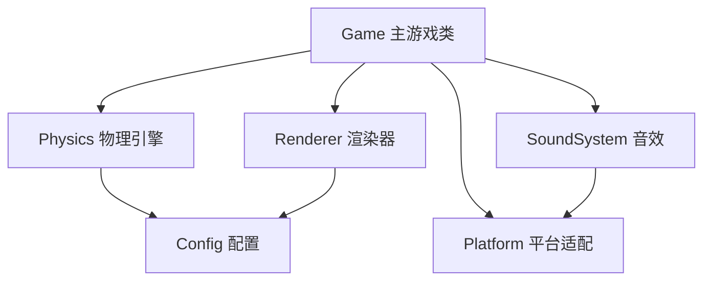

# 合成大西瓜 - 游戏逻辑文档

> 本文档详细梳理了 daxigua 项目的所有游戏逻辑，包括核心系统、特殊机制和扩展功能。

---

## 目录

1. [项目架构](#项目架构)
2. [核心游戏机制](#核心游戏机制)
3. [物理引擎](#物理引擎)
4. [水果系统](#水果系统)
5. [合成逻辑](#合成逻辑)
6. [道具系统](#道具系统)
7. [Combo 连击系统](#combo-连击系统)
8. [Fever 狂热模式](#fever-狂热模式)
9. [天气系统](#天气系统)
10. [地震系统](#地震系统)
11. [特殊实体](#特殊实体)
12. [Buff 系统](#buff-系统)
13. [渲染系统](#渲染系统)
14. [音效系统](#音效系统)
15. [平台适配](#平台适配)

---

## 项目架构

### 文件结构

```
shared/js/
├── config.js      # 游戏配置常量
├── game.js        # 主游戏类（核心逻辑）
├── physics.js     # 精简物理引擎
├── renderer.js    # Canvas 渲染器
├── soundSystem.js # 音效系统
└── platform.js    # 平台适配层（Web/微信小程序）
```

### 模块依赖关系



---

## 核心游戏机制

### 游戏状态

```javascript
// 游戏状态变量
isRunning: boolean      // 游戏是否运行中
isGameOver: boolean     // 是否游戏结束
isPaused: boolean       // 是否暂停
score: number           // 当前分数
bestScore: number       // 最高分
```

### 游戏区域配置

```javascript
GAME_AREA = {
    topMargin: 0.15,      // 顶部边距（生成区域）
    bottomMargin: 0.12,   // 底部边距（地面）
    sideMargin: 0.02,     // 左右边距
    groundHeight: 80,     // 地面高度
    wallThickness: 20     // 墙壁厚度
}
```

### 游戏规则

```javascript
RULES = {
    maxFruitLevel: 4,        // 随机生成的最大水果等级（0-4）
    mergeDelay: 100,         // 合成延迟（毫秒）
    gameOverLineY: 0.18,     // 游戏结束线位置（相对高度）
    gameOverDelay: 2000,     // 超过线后的判定延迟
    dropCooldown: 300        // 投放冷却时间（毫秒）
}
```

### 游戏主循环

```javascript
loop() {
    1. 计算时间差 dt
    2. 更新物理世界 (world.update)
    3. 处理碰撞检测 (handleCollisions)
    4. 检查游戏结束 (checkGameOver)
    5. 更新自动下落倒计时
    6. 检查 Fever 模式过期
    7. 更新天气系统
    8. 检查地震触发
    9. 更新盲盒/炸弹
    10. 更新特效
    11. 渲染画面
    12. requestAnimationFrame 下一帧
}
```

---

## 物理引擎

### 核心类

#### Vector（2D 向量）

```javascript
class Vector {
    x, y              // 坐标
    add(v)            // 向量加法
    sub(v)            // 向量减法
    mult(s)           // 标量乘法
    dot(v)            // 点积
    length()          // 向量长度
    normalize()       // 归一化
}
```

#### Circle（圆形刚体）

```javascript
class Circle {
    position          // 位置向量
    velocity          // 速度向量
    acceleration      // 加速度向量
    radius            // 半径
    mass              // 质量
    restitution       // 弹性系数
    friction          // 摩擦力
    frictionAir       // 空气阻力
    isSleeping        // 是否休眠
    fruitLevel        // 水果等级
}
```

#### Rectangle（矩形刚体）

用于墙壁和地面，始终为静态物体。

#### World（物理世界）

```javascript
class World {
    gravity           // 重力向量
    bodies            // 所有刚体
    walls             // 墙壁
    
    add(body)         // 添加刚体
    remove(body)      // 移除刚体
    update(dt)        // 更新物理
    detectCollisions() // 碰撞检测
    resolveCollisions() // 碰撞响应
}
```

### 物理参数

```javascript
PHYSICS = {
    gravity: { x: 0, y: 1.2 },   // 重力
    friction: 0.3,               // 摩擦力
    frictionStatic: 0.6,         // 静摩擦力
    restitution: 0.05,           // 弹性系数（低反弹）
    frictionAir: 0.02,           // 空气阻力
    sleepThreshold: 30,          // 休眠阈值
    sleepVelocityLimit: 0.5,     // 休眠速度阈值
    positionIterations: 4,       // 位置修正迭代次数
    velocityDamping: 0.98        // 速度阻尼
}
```

### 碰撞检测算法

1. **圆形-圆形碰撞**：比较两圆心距离与半径和
2. **圆形-矩形碰撞**：找到矩形边界上距圆心最近的点
3. **碰撞响应**：使用冲量法和位置修正

---

## 水果系统

### 水果配置（11种）

| ID | 名称 | 半径 | 颜色 | 分数 |
|----|------|------|------|------|
| 0 | 葡萄 | 26 | #9b59b6 | 1 |
| 1 | 樱桃 | 33 | #e74c3c | 2 |
| 2 | 橘子 | 40 | #e67e22 | 3 |
| 3 | 柠檬 | 48 | #f1c40f | 4 |
| 4 | 猕猴桃 | 56 | #27ae60 | 5 |
| 5 | 番茄 | 64 | #c0392b | 6 |
| 6 | 桃子 | 72 | #fd79a8 | 7 |
| 7 | 菠萝 | 82 | #fdcb6e | 8 |
| 8 | 椰子 | 92 | #dfe6e9 | 9 |
| 9 | 半西瓜 | 102 | #00b894 | 10 |
| 10 | 西瓜 | 115 | #55a630 | 100 |

### 水果生成逻辑

```javascript
generateNextFruit() {
    // 检查是否生成盲盒（5%概率）
    if (MYSTERY_BOX.enabled && Math.random() < 0.05) {
        nextIsMysteryBox = true;
        return;
    }
    
    // 检查是否生成冰封果实（8%概率）
    if (ICE_BLOCK.enabled && Math.random() < 0.08) {
        nextIsIceBlock = true;
        return;
    }
    
    // 普通水果：随机生成 0-4 级
    currentFruitLevel = Math.floor(Math.random() * 5);
}
```

### 水果投放

```javascript
dropFruit() {
    1. 检查冷却时间
    2. 创建 Circle 刚体
    3. 设置特殊属性（盲盒/冰封）
    4. 添加到物理世界
    5. 播放音效
    6. 更新冷却状态
    7. 生成下一个水果
    8. 重置自动下落倒计时
}
```

### 自动下落机制

- 默认倒计时：15秒
- Combo 时缩短：每次 combo 减少 0.5秒，最低 10秒
- 倒计时结束自动投放当前水果

---

## 合成逻辑

### 合成条件

1. 两个水果必须是 `fruit` 类型
2. 两者等级相同
3. 等级 < 10（西瓜不可再合成）
4. 都不是冰封状态
5. 都不是盲盒
6. 都不是刚创建的（100ms延迟）

### 合成流程

```javascript
mergeFruits(bodyA, bodyB) {
    1. 计算新位置（两果中点）
    2. 移除两个旧水果
    3. 创建新等级水果
    4. 继承部分速度（30%）
    5. 更新 Combo 计数
    6. 计算带连击加成的分数
    7. 添加合成特效
    8. 添加 Combo 特效
    9. 播放音效
    10. 检查冰块解冻
    11. 如果合成西瓜：额外奖励 + 触发 Buff 选择
}
```

### 分数计算

```javascript
calculateMergeScore(baseScore) {
    // 连击倍率：1 + (combo-1) * 0.5
    multiplier = 1 + (comboCount - 1) * 0.5;
    return Math.floor(baseScore * multiplier);
}
```

---

## 道具系统

### 道具配置

| 道具 | 初始数量 | 广告奖励 | 图标 | 功能 |
|------|----------|----------|------|------|
| 锤子 | 3 | +1 | 🔨 | 销毁指定水果 |
| 选果 | 2 | +1 | 🍇 | 选择下一个水果类型 |
| 跳过 | 5 | +2 | ⏭️ | 跳过当前水果 |

### 锤子模式

```javascript
activateHammer() {
    1. 检查道具数量
    2. 进入锤子模式
    3. 点击水果时销毁
    4. 扣除道具数量
    5. 退出锤子模式
}
```

### 选果功能

显示全部 11 种水果供选择，选择后替换当前待投放水果。

### 获取道具方式

1. **观看广告**：免费获取道具
2. **分享好友**：5分钟冷却，分享后获得道具

---

## Combo 连击系统

### 配置

```javascript
COMBO = {
    windowMs: 1500,           // Combo 有效窗口时间
    scoreMultiplier: 0.5,     // 每次连击增加的分数倍率
    maxCombo: 20,             // 最大连击数上限
    feverThreshold: 5,        // 触发 Fever 模式的连击数
    resetOnDrop: false        // 投放新水果时是否重置连击
}
```

### 连击逻辑

```javascript
updateCombo() {
    if (距上次合成 < 1500ms) {
        comboCount = min(comboCount + 1, 20);
    } else {
        comboCount = 1;
    }
    
    if (comboCount >= 5 && !isFeverMode) {
        activateFeverMode();
    }
}
```

### 音效变化

连击时音效 Pitch 随连击数升高：1.0 → 1.5

---

## Fever 狂热模式

### 配置

```javascript
FEVER = {
    duration: 6000,           // 持续时间 6秒
    radiusShrink: 0.85,       // 碰撞体缩小 15%
    dropCooldown: 0,          // 投放冷却归零
    bgEffect: 'pulse',        // 背景脉冲特效
    particleCount: 30         // 粒子数量
}
```

### 效果

1. **碰撞体缩小**：所有水果半径 × 0.85
2. **快速投放**：无冷却时间
3. **视觉效果**：橙红色脉冲背景

### 触发与结束

- **触发条件**：连击数达到 5
- **结束条件**：持续 6 秒后自动结束
- **结束时恢复**：碰撞体恢复原始大小，冷却时间恢复

---

## 天气系统

### 配置

```javascript
WEATHER = {
    enabled: true,
    interval: 30000,          // 切换间隔 30秒
    duration: 15000,          // 单次持续 15秒
    firstDelay: 10000,        // 首次触发延迟 10秒
    types: {
        windy: {...},         // 大风
        slippery: {...},      // 梅雨
        icy: {...}            // 霜冻
    }
}
```

### 天气类型

| 天气 | 图标 | 效果 | 概率 |
|------|------|------|------|
| 大风 | 🌪️ | 持续水平恒力 0.3 | 33% |
| 梅雨 | 🌧️ | 摩擦力降至 0.01 | 33% |
| 霜冻 | ❄️ | 弹性系数降至 0.01 | 34% |

### 天气流程

```javascript
updateWeather() {
    if (!currentWeather && now >= nextWeatherTime) {
        startRandomWeather();
    }
    if (currentWeather && now >= weatherEndTime) {
        endWeather();
    }
    if (currentWeather === 'windy') {
        applyWindForce();  // 持续施加风力
    }
}
```

---

## 地震系统

### 配置

```javascript
EARTHQUAKE = {
    enabled: true,
    triggerDelay: 1500,       // 超线后 1.5秒触发
    impulseStrength: 10,      // 向上冲量强度
    cooldown: 8000,           // 两次间隔 8秒
    screenShake: {
        duration: 600,
        intensity: 12
    }
}
```

### 触发条件

当水果顶部超过警戒线且持续 1.5秒时触发。

### 地震效果

```javascript
triggerEarthquake() {
    1. 检查冷却时间
    2. 唤醒所有水果
    3. 施加向上冲量 + 随机水平扰动
    4. 触发屏幕震动
    5. 播放音效
    6. 显示警告提示
}
```

---

## 特殊实体

### 盲盒 (Mystery Box)

```javascript
MYSTERY_BOX = {
    enabled: true,
    spawnChance: 0.05,        // 5% 出现概率
    results: {
        evolve: { chance: 0.05, levelBonus: 3 },  // 5% 进化
        bomb: { chance: 0.10, fuseTime: 3000 },   // 10% 变炸弹
        random: { chance: 0.85, levelRange: [0, 3] }  // 85% 随机低级
    },
    triggerDelay: 500         // 落地后 0.5秒判定
}
```

**盲盒流程**：
1. 生成时标记为盲盒
2. 落地后开始计时
3. 稳定后触发揭示
4. 根据概率转化为：高级水果/炸弹/随机水果

### 炸弹 (Bomb)

```javascript
BOMB = {
    fuseTime: 3000,           // 3秒引爆
    blastRadius: 120,         // 爆炸影响半径
    blastForce: 15,           // 爆炸冲量
    destroyRadius: 60,        // 直接销毁半径
    scoreBonus: 50,           // 每销毁一个水果 +50分
    radius: 35                // 炸弹显示半径
}
```

**爆炸逻辑**：
1. 60px 内水果直接销毁
2. 120px 内水果受到冲击力
3. 加分 = 销毁数量 × 50

### 冰封果实 (Ice Block)

```javascript
ICE_BLOCK = {
    enabled: true,
    spawnChance: 0.08,        // 8% 出现概率
    thawRadius: 80,           // 解冻触发半径
    visualAlpha: 0.6          // 冰层透明度
}
```

**特性**：
- 冰封状态下不能参与合成
- 附近发生合成（80px 内）时自动解冻
- 解冻后恢复正常

---

## Buff 系统

### 触发条件

成功合成西瓜时触发 Buff 选择面板。

### 可选 Buff

| Buff | 图标 | 效果 | 可叠加 | 上限 |
|------|------|------|--------|------|
| 扩容 | 📐 | 容器宽度 +10px | 是 | 5层 |
| 软化 | 🪶 | 重力 -15% | 是 | 3层 |
| 精准 | 🎯 | 显示投影辅助线 | 否 | - |

### Buff 选择逻辑

```javascript
showBuffSelector() {
    1. 暂停游戏
    2. 随机选择 3 个可用 Buff
    3. 显示选择面板
    4. 玩家选择后应用效果
    5. 恢复游戏
}
```

---

## 渲染系统

### 渲染器功能

```javascript
class Renderer {
    // 基础渲染
    clear()                   // 清空画布
    drawBackground()          // 绘制背景
    drawWalls()               // 绘制墙壁和地面
    drawGameOverLine()        // 绘制警戒线
    
    // 水果渲染
    drawFruit()               // 绘制单个水果
    drawFruits()              // 绘制所有水果
    drawPendingFruit()        // 绘制待投放水果
    
    // UI 渲染
    drawScore()               // 绘制分数
    drawToolbar()             // 绘制道具栏
    drawGameOver()            // 绘制游戏结束
    
    // 特效渲染
    drawMergeEffect()         // 合成光环
    drawComboEffect()         // Combo 文字
    drawExplosionEffect()     // 爆炸特效
    drawWeatherOverlay()      // 天气效果
    drawFeverBackground()     // Fever 背景
    
    // 特殊实体渲染
    drawMysteryBox()          // 盲盒
    drawBomb()                // 炸弹
    drawIceFruit()            // 冰封水果
}
```

### 水果渲染特效

- 径向渐变填充
- 阴影效果
- 高光反射
- 可爱表情（眼睛+微笑）

---

## 音效系统

### 音效列表

| 音效 | 文件 | 触发时机 |
|------|------|----------|
| merge | merge.mp3 | 水果合成 |
| drop | drop.mp3 | 投放水果 |
| destroy | destroy.mp3 | 锤子销毁 |
| success | success.mp3 | 合成西瓜 |
| gameOver | gameover.mp3 | 游戏结束 |
| fever_start | success.mp3 | Fever 开始 |
| earthquake | destroy.mp3 | 地震触发 |
| explosion | destroy.mp3 | 炸弹爆炸 |

### 音效特性

- **Pitch 变化**：合成音效随 Combo 数升高
- **音量控制**：全局音量调节
- **静音功能**：一键静音

---

## 平台适配

### 支持平台

1. **微信小程序**
2. **Web 浏览器**

### 适配内容

| 功能 | 微信小程序 | Web |
|------|------------|-----|
| Canvas | wx.createCanvas | document.getElementById |
| 触摸事件 | wx.onTouchXxx | addEventListener |
| 存储 | wx.getStorageSync | localStorage |
| 音频 | wx.createInnerAudioContext | new Audio |
| 分享 | wx.shareAppMessage | Web Share API |
| 排行榜 | 开放数据域 | 不支持 |

### 环境检测

```javascript
isWechat = typeof wx !== 'undefined' && typeof wx.getSystemInfoSync === 'function';
isWeb = typeof window !== 'undefined' && typeof document !== 'undefined' && !isWechat;
```

---

## 游戏结束条件

```javascript
checkGameOver() {
    for (每个水果) {
        fruitTop = position.y - radius;
        // 当水果顶部超过警戒线且速度很慢时
        if (fruitTop < gameOverLineY && velocity < 1) {
            gameOver();
        }
    }
}
```

### 游戏结束流程

1. 设置 `isGameOver = true`
2. 更新最高分
3. 保存到本地存储
4. 上传分数到排行榜
5. 显示结束画面

---

## 数据存储

### 存储项

| Key | 内容 |
|-----|------|
| daxigua_bestScore | 最高分 |
| daxigua_tools | 道具数量 JSON |
| daxigua_lastShare | 上次分享时间戳 |

---

## 调试系统

### 调试面板功能（仅开发环境）

- 添加/清空道具
- 添加分数
- 触发 Fever 模式
- 触发随机天气
- 触发地震
- 生成盲盒/炸弹/冰封水果
- 生成随机水果
- 清空所有水果
- 增加 Combo
- 开关天气/地震/盲盒/冰封系统

---

---

## 新增功能 (v2.0)

### 🎨 多皮肤系统

游戏支持多套视觉皮肤，玩家可自由切换：

| 皮肤 | 图标 | 描述 |
|------|------|------|
| 经典 | 🍉 | 原始水果风格 |
| 星球 | 🌍 | 太空行星主题 |
| 美食 | 🍔 | 汉堡食材主题 |
| 暗黑 | 🌙 | 深色霓虹风格 |

```javascript
SKINS = {
    classic: { background: {...}, ground: {...}, fruits: null },
    space: { background: {...}, ground: {...}, fruits: [...] },
    food: { background: {...}, ground: {...}, fruits: [...] },
    dark: { background: {...}, ground: {...}, fruits: [...] }
}
```

### 🎯 动态轨迹预测

启用"精准"Buff 后，显示水果下落轨迹预测线：

- 考虑重力和天气风力影响
- 预测 1.5 秒（90帧）的轨迹
- 渐变粒子流视觉效果
- 显示预测落点位置

### 📊 物理材质差异化

每种水果拥有独立的物理属性：

| 水果 | 摩擦力 | 弹性 | 特点 |
|------|--------|------|------|
| 葡萄 | 0.25 | 0.15 | 轻盈弹跳 |
| 樱桃 | 0.20 | 0.20 | 光滑高弹 |
| 猕猴桃 | 0.50 | 0.03 | 毛茸茸，最稳 |
| 菠萝 | 0.55 | 0.02 | 粗糙，超稳定 |
| 椰子 | 0.25 | 0.12 | 硬壳中弹 |

### 📳 合成震感反馈

合成时根据水果等级产生不同强度的震动：

```javascript
MERGE_FEEDBACK = {
    baseIntensity: 2,
    levelMultiplier: 1.5,
    highLevelThreshold: 7,    // 7级以上额外加强
    comboHueShift: {...}      // Combo 色调偏移
}
```

- **色调偏移**：连击数越高，画面色彩越鲜艳
- **饱和度增益**：每次连击增加 5% 饱和度

### 🧊 冰封连锁解冻

冰封果实解冻时可触发连锁反应：

```javascript
ICE_BLOCK.chainReaction = {
    enabled: true,
    chainRadius: 100,        // 连锁半径
    chainProbability: 0.6,   // 60% 触发概率
    shockwaveForce: 3,       // 冲击波力度
    maxChainDepth: 3         // 最大连锁深度
}
```

### 💫 新增 Buff

| Buff | 图标 | 效果 | 类型 |
|------|------|------|------|
| 穿透弹 | 🎯 | 下次投放穿透销毁 1 个水果 | 可叠加 |
| 蒸发 | 💨 | 消除所有 0-2 级水果 | 即时 |
| 洗牌 | 🔀 | 随机重排所有水果位置 | 即时 |

### 🌀 引力场（微型黑洞）

盲盒有 2% 概率生成引力场：

```javascript
GRAVITY_FIELD = {
    attractRadius: 150,    // 吸引半径
    attractForce: 0.5,     // 吸引力
    duration: 8000,        // 持续 8 秒
    centerForce: 2.0       // 中心强化
}
```

- 持续吸引范围内的水果
- 中心区域吸引力加倍
- 视觉螺旋线效果

### 🔮 反重力天气

天气系统新增"反重力"类型：

```javascript
WEATHER.types.antiGravity = {
    name: '反重力',
    icon: '🔮',
    gravityMultiplier: -0.3,  // 向上微弱力
    duration: 1500,           // 1.5 秒短暂漂浮
    probability: 0.25
}
```

- 所有水果产生漂浮效果
- 结束后自动唤醒所有物体
- 紫色上升粒子视觉效果

### 💣 增强炸弹系统

炸弹现在有更强的影响力：

```javascript
BOMB = {
    blastRadius: 180,      // 冲击波半径（扩大）
    destroyRadius: 90,     // 直接销毁半径（扩大）
    blastForce: 20,        // 冲量增强
    chainReaction: true,   // 炸弹连锁引爆
    screenShake: {...}     // 爆炸震动
}
```

### 📈 统计与成就系统

#### 统计项

- 总游戏局数
- 总合成次数
- 累计西瓜数
- 最大连击数
- 最高分
- 最快合成西瓜时间
- 总游戏时长

#### 成就列表（12个）

| 成就 | 条件 |
|------|------|
| 初次合成 | 首次合成大西瓜 |
| 西瓜大师 | 累计 10 个西瓜 |
| 西瓜传奇 | 累计 50 个西瓜 |
| 连击新手 | 5 连击 |
| 连击达人 | 10 连击 |
| 连击之王 | 20 连击 |
| 千分大关 | 单局 1000 分 |
| 高分玩家 | 单局 5000 分 |
| 分数王者 | 单局 10000 分 |
| 闪电手 | 30 秒内合成西瓜 |
| 初来乍到 | 游玩 10 局 |
| 老玩家 | 游玩 100 局 |

---

## 总结

合成大西瓜是一款基于物理引擎的休闲益智游戏，核心玩法是通过投放和合成水果获得高分。游戏包含丰富的系统：

1. **基础系统**：物理引擎、水果合成、道具系统
2. **进阶系统**：Combo 连击、Fever 模式
3. **趣味系统**：天气变化、地震机制、反重力天气
4. **特殊实体**：盲盒、炸弹（连锁爆炸）、冰封果实（连锁解冻）、引力场
5. **成长系统**：Buff 选择（6种）、成就系统（12个）
6. **个性化**：多皮肤系统（4套）
7. **感官反馈**：物理材质差异化、震感反馈、轨迹预测

游戏通过这些系统的组合，创造了丰富的游戏体验和策略深度。
